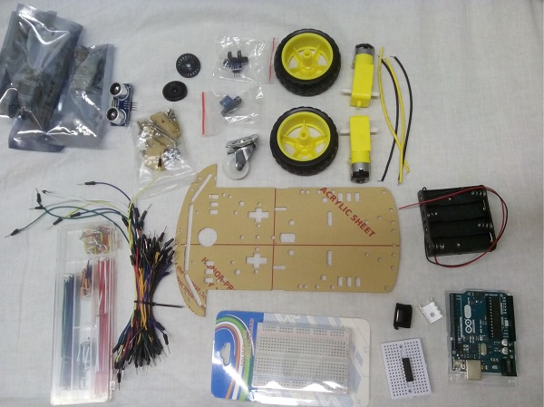
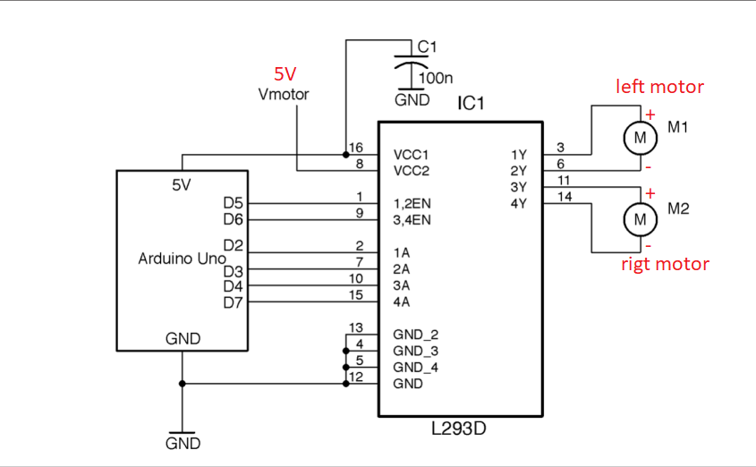
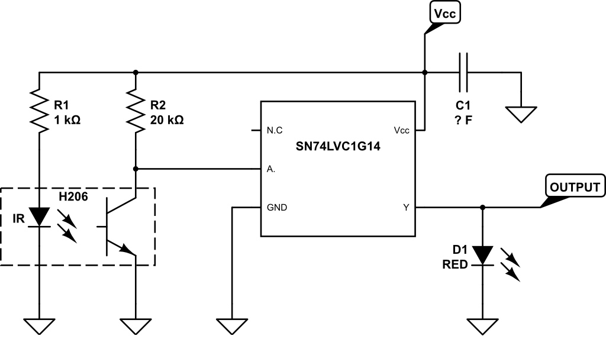
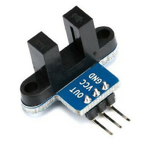
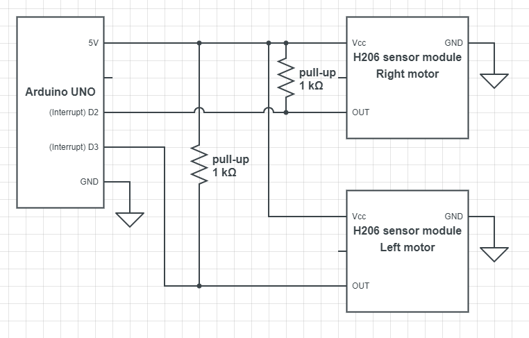
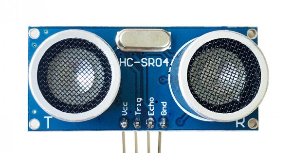
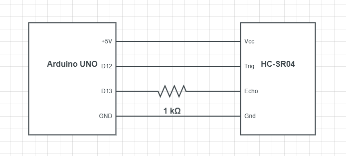

# DIY Differential Drive Robot

Inspired by a free coursera course on mobile robotics (https://www.coursera.org/learn/mobile-robot/), I'm building a differential drive robot from scratch. My goal is to test different control strategies on this robot.

## Building the Robot

### Robot parts

- chassis
- 2 rubber wheels
- 2 encoder discs with holes
- 2 1:60 motor 3-6 V 120 mA
- caster wheel
- H-bridge L-293
- 2 photoelectric sensors
- 5 ultrasonic distance sensors SR04
- Arduino UNO

> It's advised to pay attantion to the motor placements and cable orientation. I soldered the wires on the motor pins in such a way, that the yellow wires on both motors correspond to the positive polarity when robot moves forwards.

### Pinouts
ARDUINO PINS USAGE          
|Pin  |Name                   |
|:----|:----------------------|
| D2  | encoderRightPin       |
| D3  | encoderLeftPin        |
| D5  | motor2SpeedPin        |
| D6  | motor1SpeedPin        |
| D7  | motor1DirAPin         |
| D8  | motor1DirBPin         |
| D9  | motor2DirAPin         |
| D10 | motor2DirBPin         |
| D12 | distanceSensorTrigPin |
| D13 | distanceSensorEchoPin |

## Motor Control
The kit consists of 2 DC motors and 2 encoder disks. We will use the L293D H-bridge to drive the two motors with varying speed and the photoelectric sensors to count the rotations of the wheels.

The [L293's datasheet](datasheets/L293_H-Bridge.pdf) helps us understand how to use the H-Bridge. For the connection of the H-Bridge with Arduino UNO, I used the scheme shown below. The corresponding driver for the motors is located at [src/main/drive_motors.h](src/main/drive_motors.h).

## Motor Speed Sensor
For the rotary encoders the Infrared slotted optical sensors are used. Those sensors contain the Schmitt-Trigger Invertor in their circuit and work very well for our usecase.

Schematic of the module:

Schematic connected to Arduino

## Distance sensor
To measure the distance to obstacles the HC-SR04 Ultrasonic sensor module is used.

The sensor module has 4 pins: Vcc. Gnd, Trig and Echo. A 10 ms long pulse needs to be sent to the Trig pin in order to trigger the measurement. The module then emmits eight cycles of 40 kHz sonic burst. That takes 200 us. After that the Echo pin is set to HIGH until the sound wave echo is detected. We can compute the distance of the obstacle from this delay between signal send and the echo recieved. Details can be found in the [HC-SR04 datasheet](datasheets/HC-SR04-ETC.pdf).

distance = speed-of-sound * delay / 2

The schematics of HC-SR04 connected to arduino UNO board:

## Resources

[1] [Electronics Cookbook: Practical Electronic Recipes with Arduino and Raspberry Pi](https://books.google.cz/books?id=WqmSDgAAQBAJ&)

[2] [Electronics Cookbook's GitHub](https://github.com/simonmonk/electronics_cookbook)