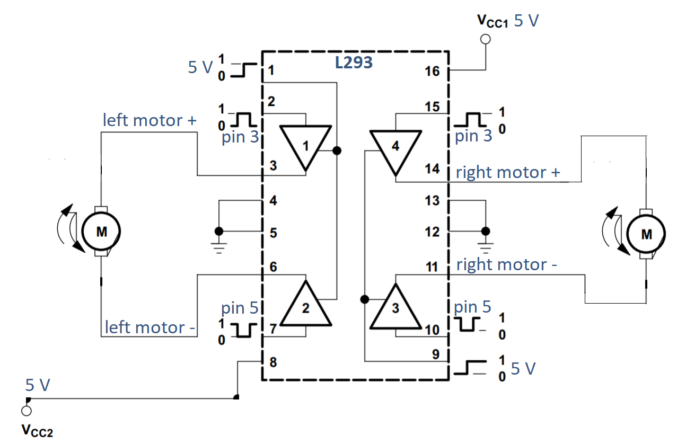
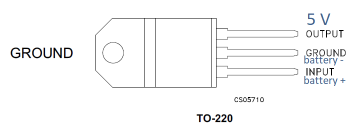

# DIY Differential Drive Robot

Inspired by a free coursera course on mobile robotics (https://www.coursera.org/learn/mobile-robot/), I'm building a differential drive robot from scratch. My goal is to test different control strategies on this robot.

## Building the Robot

### Robot parts

- chassis
- 2 rubber wheels
- 2 encoder discs with holes
- 2 1:60 motor 3-6 V 120 mA
- caster wheel
- H-bridge L-293
- 2 photoelectric sensors
- 5 ultrasonic distance sensors SR04
- Arduino UNO

> It's advised to pay attantion to the motor placements and cable orientation. I soldered the wires on the motor pins in such a way, that the yellow wires on both motors correspond to the positive polarity when robot moves forwards.

## Motor Control

### Stage 1 -- Controlling Motor Velocity Using a Potenciometer
The easiest velocity control we can achieve is using the potenciometer to control the voltage applied to the motors. This allows us to drive robot forwards with varying velocity, but not backwards.

### Stage 2 -- PWM

In this stage I connect both wheels to the same PWM signal that will be able to move wheels forward with varying velocity (but not backwards).

To connect the H-bridge to the Arduino I used the [L293's datasheet](datasheets/L293_H-Bridge.pdf) and to use the Low drop-out 5 V voltage regulator I read [this datasheet](datasheets/LDO-L78S05CV.pdf). The used code that I loaded into the Arduino to make the PWM work can be found under the `src/stage2_pwm` folder. The analog pin A0 is connected to the potenciometer indroduced in previous stage. By adjusting the potenciometer resistance, the wheel velocity is changing. Because I only have a primitive hand-held multimeter to my disposal I used the A1 analog pin as a kind of probe to see what is happaning on which pin.

### Stage 3 -- H-Bridge